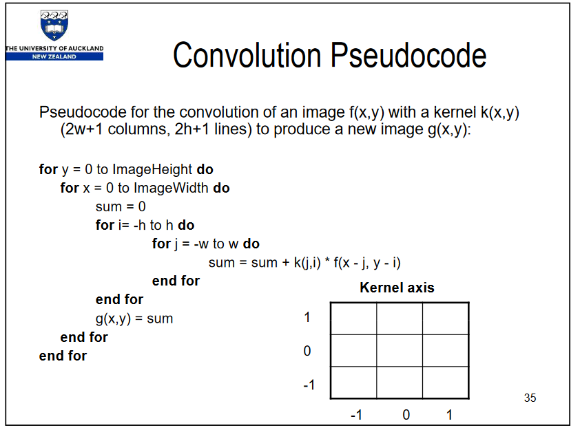

# Evidence 4: 2Dconvolution using CUDA

## 2D Convolution

This program uses CUDA to modify an image using a specified kernel.

The kernel convolution implemented is similar to the one in the process explained in this video:
[How blurs and filters work](https://youtu.be/C_zFhWdM4ic?t=159)

This one uses a simple weighted distribution Kernel to make a box blur over an image. It doesn't prioritize any pixel over the other so the weights are the same amongst the box.

## Constant memory & caching

### Why use this?

1. Constant memory variables are similar to global variables in that, they are visible to all threads.
2. They are stored in L2 Cache. The access speed to this location is only second to the L1 cache (very fast access!) as seen in the simplified diagram below:


> Programming Massively Parallel Processors: A Hands-on Approach by Wen-mei W. Hwu, David B. Kirk, Izzat El Hajj. Excerpt available [here](https://books.google.com.mx/books?id=7H9dEAAAQBAJ&pg=PA159&lpg=PA159&dq=%22There+are+three+interesting+properties+in+the+way+the+filter+array+F+is+used+in+convolution.%22&source=bl&ots=6ZPETqJPB2&sig=ACfU3U2lGo8fMQDw9l3zS_RO1-nktT7IGA&hl=es-419&sa=X&ved=2ahUKEwjVrJDa6aOGAxVSEUQIHcJYAIQQ6AF6BAgJEAM#v=onepage&q=%22There%20are%20three%20interesting%20properties%20in%20the%20way%20the%20filter%20array%20F%20is%20used%20in%20convolution.%22&f=false>)

### Implementation

First, initialize the kernel that will be iterating over the image. Since the kernel will be used repeatedly by the GPU to process each section of the original image, we might as well store it in the GPU cache. By telling it to store it in constant, we make CUDA aggressively cache the constant variable in memory.

```cu
#define FILTER_SIZE 3
#define FILTER_OFFSET (FILTER_SIZE/2);
__constant__ float FILTER[3 * 3];
```

We indicate it won't change during runtime, so we need to copy as a "symbol" (a device variable).

```cu
cudaMemcpyToSymbol(FILTER, h_filter, filter_byte_size);
```

## Why not use the CPU?

Images, specially camera photographs, tend to be very large in size. This implementation uses a very small file size, but for much larger, very high resolution images, the CPU will reach some issues.

### Memory bandwidth

A GPU has much higher bandwidth for transferring data with its multiple control units

### Memory distance

**Information locality** & **Actual physical distance**

Though the capacity in cache in CPU's is much larger and would allow all of our instructions to be accessed really fast, if we needed to share information to other cores, we would have to go L1 Cache -> L2 Cache -> L3 Cache. Ech of these jumps imply more time transferring data than actually using it.

A GPU, on the other hand, can simply send it to L2 Cache from any of its cores, which makes it shared to every other core that might need that information.


> Nvidia Docs "CUDA C programming guide". Availabe [here](https://docs.nvidia.com/cuda/cuda-c-programming-guide/index.html)

### One big process

A CPU will interpret these instructions and run them sequentially on its own process. The issue here is we would need to parallelize the tasks in CPU, but these tasks are really quite simple. Even splitting this tasks might generate much more overhead than just running them sequentially.

Moreover, the small amount of cores in comparison to the GPU mean that all these tasks can only be subdivided in very large sets.We would fill our CPU with very long simple instructions that could have been subdivided into thousands of GPU cores.

## Why PGM format?

PGM format allows me to dump the raw data of each location very simply. I draw a white canvas, paint a black line on it and CUDA processes it with a kernel that box-blurs the input.

## Asymptotic analysis

The implementation of the arrays forces any data to be stored as a 1D array. We want to keep the continuity of the memory locations so it wont jump from pointer to pointer.

The task is divided in grids of 64x64 and blocks of 16x16. I can change this parameter later because it is a task that can be much further subdivided, which would give us much better performance.

See the following example by Patrice's pseudocode of one of their lectures at Auckland University 



Original presenttion available here: [Patrices Lecture PDF presentation](https://www.cs.auckland.ac.nz/compsci373s1c/PatricesLectures/Convolution_1up.pdf)

This pseudocode has $O(n^2 * m_k * n_k)$ !

If the kernel size is similar to the input size... well that is basically $O(n^4)$.

Now, in this cuda implementation, the complexity of the task is reduced to $O(n^2)$ *for each core*. Now this is crucial: For *each core* we add to the processing of this, the further the task is subdivided. Add that to the fact that all memory accesses are contiguous both in space and lodgically (which the GPU can transfer much faster), the difference is quite significant!

## Testing

The test designed is visual, with a few assertions to make sure we input and output the image files.

The resulting files [test.pgm](./test.pgm) and [blur.pgm](./blur.pgm) can be seen in an online viewer or opened with an editor.

[test.pgm](./test.pgm) has the middle section crossed by a black diagonal and can be seen, even when edited in a text file that *clearly* there's a line in the middle.

[blur.pgm](./blur.pgm) on the other hand, is the same image but the diagonal is now blurred. The blurring might be difficult to detect in the image BUT when in a text editor, the "numerical blurring" is very clear.

All parameters are hard coded (for now). Simply compile the `kernel.cu` file and run it, nothing else is needed.

The images can be seen using an online viewer such as [this one](https://imagetostl.com/view-pgm-online) or download [IrfanView](https://www.irfanview.com/). IrfanView is a pretty light-weight image viewer, no bloat, no ads.

Here's how the images should look like:

### NO BLUR


### BLURRED


